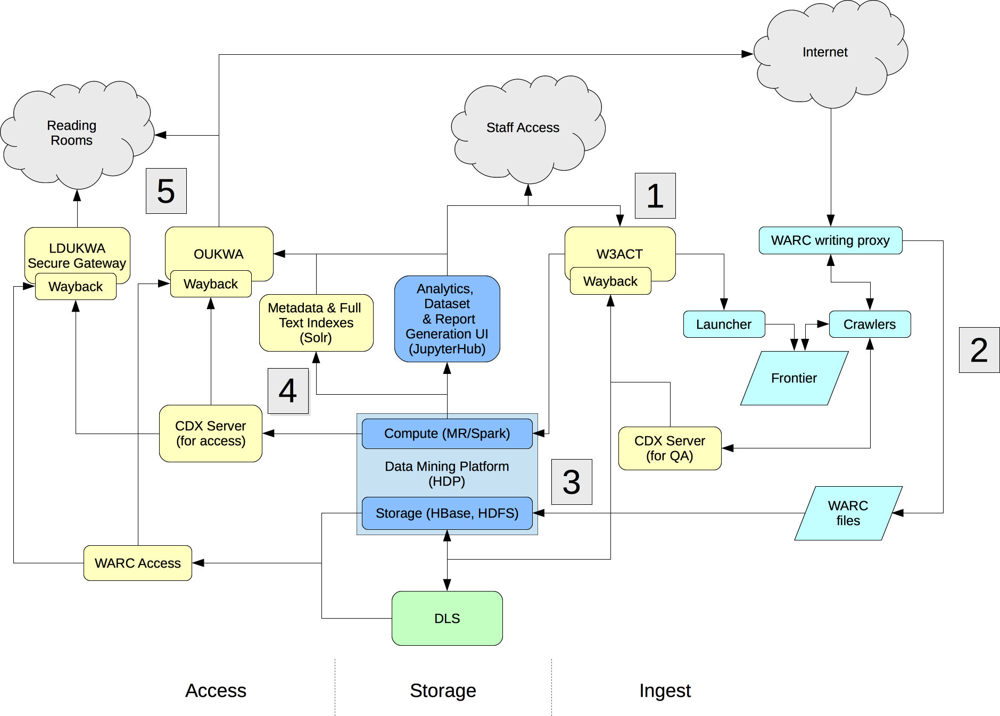

UKWA Documentation
==================

Technical documentation for the UK Web Archive.

<!-- MarkdownTOC depth=2 autolink=true bracket=round lowercase_only_ascii=true -->

- [Introduction](#introduction)
- [System Overview](#system-overview)
- [Services & Repositories](#services--repositories)
	- [Services](#services)
	- [Management](#management)
	- [Monitoring](#monitoring)
	- [Major Components & Interfaces](#major-components--interfaces)
- [Life-cycle Overview](#life-cycle-overview)
	- [Harvesting Workflow](#harvesting-workflow)
- [Further Information](#further-information)

<!-- /MarkdownTOC -->

Introduction
------------

This document outlines the current and near-future web archiving system. It is intended to give an introduction to the major components and tie together the different source code repositories that are involved.

System Overview
---------------

Services & Repositories
-----------------------

<table width="100%" style="text-align: center !important; display: table !important;">
	<thead width="100%">
	    <tr><th></th><th>Ingest</th><th>Storage</th><th>Access</th></tr>
    </thead>
    <tbody width="100%">
		<tr>
			<th rowspan="2">Services</th>
			<td><a href="https://github.com/ukwa/ukwa-ingest-services"><i>ukwa-ingest-services</i></a></td>
			<td>HDFS, HBase</td>
			<td><a href="https://github.com/ukwa/ukwa-access-services"><i>ukwa-access-services</i></a></td>
		</tr>
		<tr>
			<td>On Docker</td>
			<td>Native</td>
			<td>On Docker</td>
		</tr>
		<tr>
			<th rowspan="2">Management</th>
			<td colspan="3" align="center"><a href="https://github.com/spotify/luigi"><i>Python Luigi</i></a> tasks defined in <a href="https://github.com/ukwa/python-shepherd"><i>python-shepherd</i></a></td>
		</tr>
		<tr>
			<td><i>Ingest Task Scheduler</i></td>
			<td></td>
			<td><i>Access Task Scheduler</i></td>
		</tr>
		<tr>
			<th rowspan="2">Monitoring</th>
			<td colspan="3" align="center">Tasks in <a href="https://github.com/ukwa/ukwa-monitor"><i>ukwa-monitor</i></a></td>
		</tr>
		<tr>
			<td colspan="3" align="center">Monitoring Task Scheduler</td>
		</tr>
	</tbody>
</table>

There are three major areas to cover: Services, Management & Monitoring. The Services are the main components of the crawl system, usually deployed as Docker containers. The Management system coordinates the tasks that act upon the services, in order to automate whole content management life-cycle. The Monitoring system runs independently of the Management system, but automates checks that help ensure the whole system is running correctly.

### Services ###

There are two main sets of services, each of which has one or more [*Docker Compose*](https://docs.docker.com/compose/) files to define different deployments, from local development to full production.

- [*ukwa-ingest-services*](https://github.com/ukwa/ukwa-ingest-services) with separate Docker Compose definitions for the crawl engine (Heritrix3 etc.) and for the frontend services (e.g. W3ACT etc.) 
- [*ukwa-access-services*](https://github.com/ukwa/ukwa-access-services) which covers end-user services like our website, APIs etc.

### Management ###

The [*python-shepherd*](https://github.com/ukwa/python-shepherd) code base (rename to ukwa-manage?) contains all the ‘glue’ code that orchestrates our content life-cycle management, implemented as [*Python Luigi*](https://github.com/spotify/luigi) tasks.

All events, across all production systems, are initiated by cron jobs on `wash`. For example, a cron job on `wash` may initiate a Luigi task on the the `ingest` server that scans crawl engines for new content to upload to HDFS. Both the `ingest` and `access` servers have a copy of `python-shepherd` installed, and each runs their own LuigiD task scheduler (which provides a UI and manages task execution).

n.b. we may split the management codebase into a library and three separate task sets (for ingest, storage and access) in the future.

### Monitoring ###

The [*ukwa-monitor*](https://github.com/ukwa/ukwa-monitor) codebase monitors and reports on all UKWA processes, including ingest. This provides HTML reports, a dashboard, and raises alerts by probing the production system. It is also based on Luigi tasks, but no part of any production system depends on it, and it runs it’s own cron jobs (rather than being initiated by `wash`) and it's own LuigiD scheduler. If it's down, nothing else should be affected. 

The monitoring tasks check that the necessary services are running, and that critical management tasks have been executed successfully. If services are down, or transient failures become persistant, it is the role of the monitor engine to raise the alert.

### Major Components & Interfaces ###

The curation front end, the frequent crawl engine, the shepherd, the domain crawler, the storage, the indexes, the access services.

Life-cycle Overview
-------------------

High-level workflows are described here - more detailed documentation on individual tasks will be available [here](http://ukwa-shepherd.readthedocs.io/en/latest/) one day!

### Harvesting Workflow ###

n.b. * UNDER DEVELOPMENT *

| Step              | Description   |
| ----------------- | ------------- |
| Start/stop crawls |  |
| Move to HDFS      |  |
| Analyse           | As content appears on HDFS, we first need to identify the ‘chunks of crawl’ described above. We start this by scanning log files. For each new set of logs, we scan for associated WARC files, potential documents, run basic stats analysis. |
| Verify            | This would be the logical spot to run the Map-Reduce hasher and double-check the hashes are as expected, at which point we can clear the files on the crawl servers for deletion. |
| Assemble          | We take the initial chunks of logs and warc and assemble them into a single description that also contains any required metadata in associated ZIP files. This also contains the SHA-512 of the files and any necessary ARK identifiers. The main result is a JSON description of the crawl at a given point in time. Any crawl process that generates these can be plumbed into the downstream processes. |
| Package & Submit  | Take each chunk and assemble SIPs incrementally, Submit them to DLS |
| Validate          | We check the DLS export, and we check against our DLS Access Point. |
| Analysis & Indexing | ...following on from Assembly, we can now start to process chunks of crawl for access. See [*2017 Web Archive Search Strategy*](http://drive.google.com/open?id=1CJUvyI1XPOZt6oEl_2oFRJHXrv8K3_jT36AkOSEcjzw) |

Further Information
-------------------

* [Design Principles](Design-Principles.md)
* [System State Management](System-State-Management.md)
* [Deployment](Deployment.md)
* [Development](Development.md)
    * [Working With Luigi](Working-With-Luigi.md)
* [Future Development](Future-Development.md)
